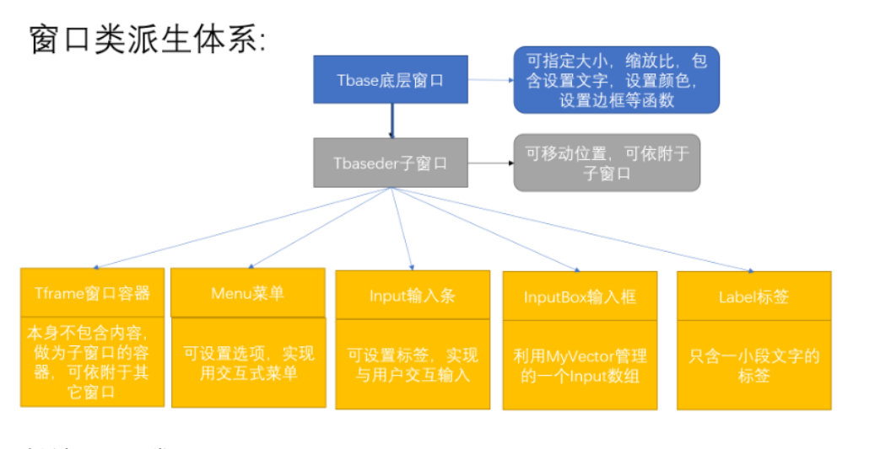

# 项目信息

- 博客地址: [如何用 C/C++ 实现一个图形库框架](http://mywhp.cn/blog/#/blog/39)

# 项目演示

让我们先来看几张截图, **你能想象这是完全通过控制台实现的吗？** (没错, 就是刚学C语言那个时候的黑框框)

## 扫雷游戏

## 输入框

## 输入box

## 菜单

## 标签

---

这是我用C/C++编写的一个图形化框架。我们都知道，现在市面上已经有很多成熟且优秀的图形化框架。那么，为什么我还要费心去创造一个，而且相比之下，我的框架显得相当简陋呢？答案其实很简单——我当时不知道！

没错，那时我才大一，一无所知。如果我知道有那么多成熟且好用的框架存在，我肯定不会选择自己动手。回到大一的时候，我只学过C语言，而C语言的界面就是一个单调的黑框。但这并没有浇灭我制作游戏的热情。

于是，我开始努力编写各种游戏，比如贪吃蛇、扫雷、飞机大战，还有各种管理系统，如通讯录、库存管理、学生信息管理等等。随着时间的推移，我逐渐发现，每次为了构建这些程序的界面，我都要花费大量的时间和精力。

因此，我决定将这些界面功能封装起来，以便将来能够更方便地使用。就这样，这个框架应运而生了。

# 实现思路

因为一开始使用的 C 语言, 所以实现思路比较原始, 将整个界面看成一个二维数组, 每个元素对应一个像素, 将一些常用的操作进行封装, 比如画直线, 画矩形。

后面学到了 C++, 利用面向对象的思想, 将一些常用的类进行封装, 大致结构如下:

## 底层窗口

主要使用二维数组的形式来记录窗口信息，使用了两个二级指针，分别记录内容信息和颜色信息，创建类时指定窗口大小，然后为两个指针分别申请对应大小的堆内存。底层窗口类实现了一些基本的设置文字，颜色，边框，可见性的操作

## 子窗口的实现方式1——指针绑定

指针绑定思路: 每次新创建一个子窗口时，直接将子窗口的二级指针绑定到底层窗口的指定位置，经过我实践发现有以下优缺点：
- 优点：省内存。
- 缺点：子窗口和底层窗口行为不同，不可公有派生；由于是指针绑定，子窗口直接影响到底层窗口，销毁子窗口时不可恢复，如果要解决这个问题，就需要新申请空间记录初始状态，就不省内存了；移动子窗口时需要重新绑定一遍，耗时。

## 子窗口的实现方式2——动态移动

动态移动思路：每次新创建一个子窗口时，跟底层窗口一样，新申请内存存储数据，需要绑定底层窗口时，底层窗口容器记录子窗口地址，输出窗口时，遍历地址容器，根据相对位置来显示。经过我实践发现有以下优缺点：
- 优点：可快捷移动子窗口位置，子窗口与底层窗口行为一致，可公有派生。
- 缺点：创建大量子窗口时比较需要大量的内存，输出时会先输出底层，再输出上层，有的时候底层数据全被遮挡了，做了很多无用工作。

# 资源

- 完整视频: [完整视频](./file)
- 可执行文件: [testList.exe](./file/testList.exe) (windows)

# EXT

值得一提的是，我耗费了半个学期完成的项目，最终得分并不高。我不理解为何付出了那么多时间和精力，却没有得到好的结果。那时的我不服气，认为班上没有人能比我用 C++ 写得更好。现在回想起来，我很怀念那时候的自己，虽然无知，却无所畏惧。

最后, 附上我大一做的一个比较有意思的动画做为收尾

- 源代码: [cartoon.c](./file/cartoon.c)
- 可执行文件: [cartoon.exe](./file/cartoon.exe) (windows)
- 视频: [cartoon.mp4](./file/cartoon.mp4)
